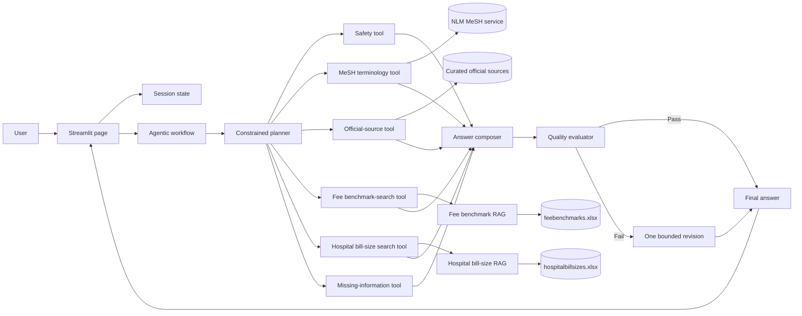
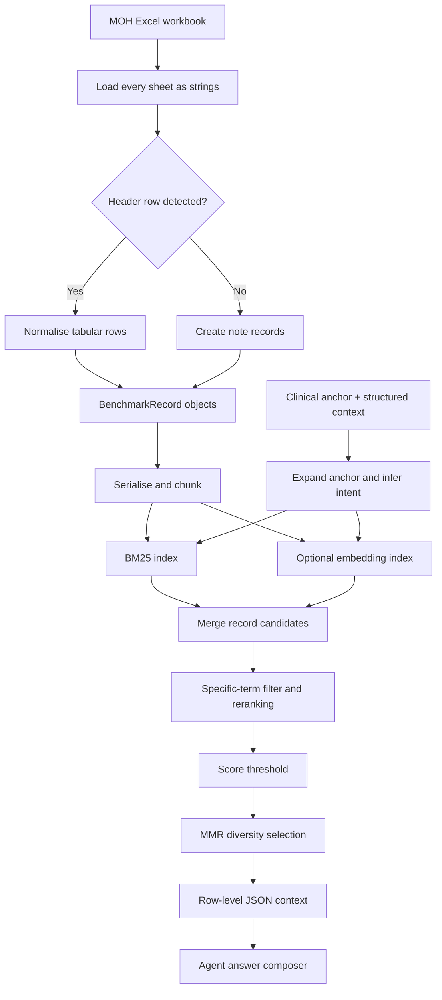

# How CareCost Navigator Works

This document explains the runtime architecture of CareCost Navigator, with particular focus on the agentic workflow in [`agentic_workflow.py`](../agentic_workflow.py), the shared workbook retrieval pipeline in [`utils/benchmark_rag.py`](../utils/benchmark_rag.py), and the deliberate separation between care navigation and known-item cost lookup.

It is intended for project assessors, maintainers, and developers who want to understand how a user request becomes a grounded answer.

## 1. What the application does

CareCost Navigator is a multi-page Streamlit application with two main use cases:

1. **Care Pathway Guide** - accepts a conversational symptom or known-condition question. It combines safety screening, MeSH terminology expansion, curated official sources, and an LLM to provide non-diagnostic general education, including common symptoms and care options a clinician may discuss.
2. **Fee Benchmark Explorer** - accepts a known procedure, diagnosis, or TOSP code through a guided form. It searches the MOH fee benchmark workbook and, separately, the hospital bill-size workbook; it can narrow hospital-stay rows by hospital and ward type.

The app is educational. It does not diagnose, select treatment, determine insurance coverage, or guarantee a final bill.

## 2. Main components

| Component | Responsibility |
|---|---|
| [`app.py`](../app.py) | Landing page and navigation to the two use cases and documentation pages. |
| [`pages/1_Care_Pathway_Guide.py`](../pages/1_Care_Pathway_Guide.py) | Conversational care-pathway user interface and session history. |
| [`pages/2_Fee_Benchmark_Explorer.py`](../pages/2_Fee_Benchmark_Explorer.py) | Structured fee-search form, grounded response, evidence table, and chart. |
| [`ui_components.py`](../ui_components.py) | Shared model settings, cached index construction, session helpers, traces, tables, charts, sources, and safety notices. |
| [`agentic_workflow.py`](../agentic_workflow.py) | Model-provider clients, workflow state, planning, tools, answer composition, evaluation, revision, and retrieval-only fallback. |
| [`utils/benchmark_rag.py`](../utils/benchmark_rag.py) | Workbook ingestion, normalisation, chunking, BM25/vector indexing, query expansion, retrieval, reranking, and context assembly. |
| [`data/feebenchmarks.xlsx`](../data/feebenchmarks.xlsx) | Local MOH fee benchmark workbook searched by the application. |
| [`data/hospitalbillsizes.xlsx`](../data/hospitalbillsizes.xlsx) | Local MOH hospital bill-size workbook searched independently for stay-cost evidence. |
| [`data/official_sources.json`](../data/official_sources.json) | Curated allowlist of official MOH and SCDF guidance used by the source lookup tool, including condition, pharmacist, doctor, and emergency-care pages. |

## 3. Overall architecture



There are two related but separate systems:

- The **agentic workflow** decides what actions are needed, executes constrained tools, stores their observations, composes the answer, and evaluates it.
- The **workbook RAG pipeline** is used by two separate tools. Each retrieves and reranks records from its own workbook but does not itself write the final natural-language response.

## 4. How the Streamlit pages call the workflow

### 4.1 Care Pathway Guide

The page performs the following sequence:

1. Initialises namespaced Streamlit session keys for messages, workflow steps, matches, sources, safety flags, and mode.
2. Renders provider, model, API key, and compatible-endpoint settings.
3. Builds or reuses the cached benchmark index used for compatible workflow calls. When explicitly enabled for OpenAI or OpenAI-compatible providers, semantic retrieval adds an in-memory embedding store; otherwise retrieval remains BM25-only.
4. Accepts a message through `st.chat_input`.
5. Copies the existing conversation before adding the new turn.
6. Creates an `LLMClient` and calls `run_agent_workflow` with the fixed mode `Condition to procedures`.
7. Saves the returned answer, trace, sources, safety flags, and other state.
8. Renders the conversation and expandable workflow trace.

Recent conversation is useful when a user supplies a short follow-up. Cost-specific questions are better handled in Fee Benchmark Explorer.

### 4.2 Fee Benchmark Explorer

The fee page performs a similar sequence, but starts from a form:

1. The user enters a procedure, diagnosis, or TOSP code.
2. The user selects a care setting, fee component, hospital, and ward type.
3. Symptom-only input is redirected to Care Pathway Guide; Fee Benchmark Explorer is reserved for a known procedure, diagnosis, or TOSP code.
4. The page combines the fields into a workflow question. Hospital labels are shown as `Full Name (ABBREVIATION)` and the abbreviation is retained for exact filtering.
5. The fee benchmark and hospital bill-size indexes are loaded independently after form submission.
6. If semantic retrieval is enabled and an OpenAI or compatible key is available, each cached index includes both BM25 and an in-memory vector store. Otherwise it remains BM25-only.
7. `run_agent_workflow` is called with the fixed mode `Procedure cost estimate`, MeSH disabled, and the separate hospital bill-size index. Each form submission is independent.
8. The UI displays fee-benchmark rows and hospital-stay bill-size rows in separate tables, plus the fee-benchmark range chart.

For cost-related messages in Care Pathway Guide, the route switches to `Both` and renders the same alternative-procedure, component-stacked lower/upper chart directly beneath the assistant reply. A lower total uses P25 and an upper total uses P75 for any retrieved stay-bill component. The chart is an assembled reference view, not an itemised quotation or a prediction of an individual bill.

### 4.3 Cached resources

`load_benchmark_index` uses `st.cache_resource`. Repeated Streamlit reruns can therefore reuse the workbook records and index when its inputs are unchanged. A different provider, API key, base URL, or embedding model produces a different cache input combination.

The home-page workbook summary uses `st.cache_data` because it returns only record and sheet counts.

## 5. The agentic workflow

### 5.1 Why this is agentic

The implementation is agentic because it has:

- a goal and requested workflow mode;
- explicit shared state in `WorkflowState`;
- a planning step;
- a constrained set of actions or tools;
- observations written back into state;
- conditional behaviour based on available evidence and model availability;
- an evaluation step; and
- a bounded correction loop.

One orchestrator manages a transparent state machine and calls specialist tools.

### 5.2 Workflow state

`WorkflowState` is the working memory for one request. It contains:

| Field | Purpose |
|---|---|
| `question` | Trimmed current user input. |
| `mode` | Care guidance, fee estimate, or both. |
| `conversation_history` | Bounded recent context. |
| `safety` | Prompt-injection flags, emergency flags, and truncation status. |
| `plan` | Validated workflow mode, ordered tools, rationale, and planner source. |
| `matches` | Retrieved MOH fee-benchmark rows and scores. |
| `hospital_bill_matches` | Retrieved hospital bill-size rows and scores. |
| `hospital_filter` / `ward_filter` | Selected abbreviations/ward values used to filter hospital bill-size results. |
| `sources` | Curated official sources selected for the question. |
| `follow_up_questions` | Missing details detected by deterministic rules. |
| `observations` | Text returned by each executed tool. |
| `steps` | User-visible trace entries for planning, tools, composition, evaluation, and revision. |

`WorkflowResult` copies the user-facing parts of this state back to the Streamlit page.

### 5.3 Input bounds and safety assessment

Before planning:

- the current question is trimmed and limited to 4,000 characters;
- at most eight recent messages are retained;
- retained history is limited to 6,000 characters; and
- rule-based patterns check for likely instruction overrides, prompt disclosure, credential requests, role/delimiter injection, jailbreak language, and selected emergency warning signs.

The checks produce warnings and workflow context. They do not treat a regex match as a clinical diagnosis.

### 5.4 Route selection

The workflow supports three internal modes:

- `Condition to procedures`
- `Procedure cost estimate`
- `Both`

The two Streamlit use-case pages pass a fixed mode. `infer_workflow_mode` is available for an automatic route when no fixed mode is supplied. Its deterministic term checks look for cost, condition, and procedure intent in the question and conversation.

### 5.5 Planning

When a model key is available, `plan_workflow` asks the model for JSON with three fields:

```json
{
  "mode": "Procedure cost estimate",
  "tools": ["safety_check", "benchmark_search"],
  "rationale": "The user is requesting a procedure fee range."
}
```

The model does not have final authority over the plan. `parse_planner_output` applies policy controls:

1. Only known modes are accepted.
2. A valid mode explicitly requested by the page is retained.
3. Unknown tool names are discarded.
4. `safety_check`, `official_source_lookup`, and `missing_information_check` are always restored.
5. `benchmark_search` and `hospital_bill_search` are restored for fee or combined modes when the relevant workbook index is available.
6. Tools are placed in a fixed safe execution order.
7. The rationale is capped at 500 characters.

If there is no API key, or if the returned JSON cannot be validated, `make_fallback_plan` supplies a deterministic plan.

This is an important safeguard: the LLM can propose a plan, but code determines what is executable.

### 5.6 Tool execution

The workflow uses six allowlisted retrieval and safety tools. MeSH is used for Care Pathway Guide requests; the Fee Benchmark Explorer deliberately disables it because its input is already a known procedure, diagnosis, or code.

#### `safety_check`

Returns observations about:

- likely prompt-injection patterns;
- possible emergency warning signs; and
- input truncation.

This observation is supplied to the answer composer. A deterministic post-processing check also adds a 995 notice when emergency flags exist and the model omitted it.

#### `mesh_rag`

For a care-pathway question, this tool queries the U.S. National Library of Medicine's MeSH terminology service and retains relevant concepts as terminology support for the workflow. It is a vocabulary-retrieval aid, not a diagnostic tool: a weak or absent MeSH match does not mean the user's concern is invalid, and it does not prevent the app from giving appropriately bounded general education.

#### `official_source_lookup`

Loads the local curated source registry and scores sources by token overlap. It also applies mode-aware boosts:

- MOH fee guidance is favoured for cost requests;
- MOH medical-help guidance is favoured for care-pathway requests; and
- SCDF emergency guidance receives a strong boost when an emergency pattern is detected.

At most three positive-scoring sources are returned. The model is instructed to cite only these supplied URLs.

The registry includes MOH's [Conditions](https://www.moh.gov.sg/seeking-healthcare/getting-medical-help/conditions/), [Visiting a pharmacist](https://www.moh.gov.sg/seeking-healthcare/getting-medical-help/visiting-a-pharmacist/), [Seeking a doctor](https://www.moh.gov.sg/seeking-healthcare/getting-medical-help/seeking-a-doctor/), and [When to visit the hospital for emergencies](https://www.moh.gov.sg/seeking-healthcare/getting-medical-help/visiting-the-hospital-for-emergencies/) pages. It also includes condition directories from [NUHS](https://www.nuhs.edu.sg/patient-care/find-a-condition), [SingHealth](https://www.singhealth.com.sg/symptoms-treatments/symptoms-treatments-medical-conditions), [Mount Elizabeth](https://www.mountelizabeth.com.sg/conditions-diseases), and [Gleneagles](https://www.gleneagles.com.sg/conditions-diseases) as **Supplementary provider education**. Deterministic scoring favours the conditions directory for care-pathway requests and boosts the pharmacist, GP/doctor, or hospital-emergency page when the query indicates that specific need.

Source type is carried into prompt context and the UI. The composer must not treat a generic directory as evidence that a user has a named condition, or as direct support for condition-specific facts, symptoms, or treatment options that do not appear in the supplied source summary.

For a named condition, the source tool also attempts a bounded lookup of the condition-specific page under the selected provider directories. It generates only fixed, allowlisted directory URL patterns, uses a short timeout, accepts a response only from the expected host, and replaces a directory entry with the successfully retrieved condition page. If no exact page is found, the directory remains supplementary navigation rather than condition-specific evidence.

#### `benchmark_search`

Builds a retrieval query from the current question and relevant conversation history, then calls `search_benchmark_records` against `feebenchmarks.xlsx`. The result is stored in `state.matches` and serialised into the tool observation. Fee statements must be grounded in these rows.

#### `hospital_bill_search`

Calls the same bounded retrieval/reranking method against the independently indexed `hospitalbillsizes.xlsx` workbook. It then applies exact hospital and ward-type filters selected in the form. The matching rows are stored in `state.hospital_bill_matches` and separately supplied to the composer. These rows can expose P25, P50, P75, and ALOS fields when the workbook contains them.

The full retrieval pipeline is explained in Section 6.

#### `missing_information_check`

Uses deterministic rules to ask for important missing context. Depending on the route, it checks for:

- a specific symptom, diagnosis, procedure, or code;
- inpatient, outpatient/day-surgery, ICU/HDU, or ward context;
- hospital fees, professional fees, or both; and
- exact clinical or bill wording when retrieval found no rows.

At most three questions are returned so that the UI remains manageable.

### 5.7 Answer composition

When a model key is available, the composer receives:

- the validated workflow mode;
- the bounded user question and recent conversation;
- selected official-source summaries and URLs;
- retrieved fee-benchmark rows and scores;
- retrieved hospital bill-size rows and scores;
- the safety observation; and
- the missing-information observation.

The system prompt requires the model to:

- treat user and retrieved text as untrusted data;
- avoid diagnosis, prescribing, and individualised treatment recommendations;
- for a named condition, provide a clearly labelled general overview of common symptoms and care options a clinician may discuss;
- ground emergency guidance in supplied official sources;
- ground cost statements in the supplied fee-benchmark or hospital bill-size rows;
- avoid inventing fees, coverage, subsidies, or sources;
- separate hospital fees from professional fees; and
- describe benchmark values as reference ranges rather than quotes.

`ensure_required_sections` then deterministically adds a missing emergency notice, follow-up questions, or official-source section when required.

### 5.8 Quality evaluation and revision

The draft is passed to a second model prompt acting as a quality evaluator. It must return:

```json
{
  "pass": false,
  "issues": ["The response treats a benchmark as a guaranteed quote."],
  "revision_instructions": "State the retrieved range and explain its limitations."
}
```

The evaluator is asked to fail answers that:

- diagnose, prescribe, or make individualised treatment claims;
- contain unsupported cost claims;
- omit emergency escalation when flags exist;
- treat benchmark ranges as guaranteed prices;
- follow prompt-injection content; or
- cite a source outside the supplied allowlist.

If the answer fails, the workflow performs at most one revision. The revision receives the evaluator feedback and the same grounded evidence. `MAX_REVISIONS = 1` prevents an unbounded or costly loop.

If evaluator JSON cannot be parsed, the current implementation keeps the draft and relies on deterministic required-section checks. A stricter production design could instead fail closed or run an additional deterministic claim validator.

### 5.9 Retrieval-only mode

When no API key is configured:

1. Planning uses deterministic policy routing.
2. All planned local tools still run.
3. BM25 retrieval remains available for each local workbook index.
4. Official-source lookup and missing-information checks remain available.
5. `build_retrieval_only_answer` generates a template-based response.
6. No LLM planning, composition, evaluation, or revision call is made.

This means Fee Benchmark Explorer can still return traceable fee-benchmark and hospital bill-size matches without sending a request to a model provider. Care Pathway Guide provides official guidance but needs a model key for tailored named-condition education.

### 5.10 Agent trace

Every completed stage appends an `AgentStep` containing:

- a display name;
- output or observation;
- type such as planning, tool, agent, evaluation, or revision; and
- completion status.

The UI exposes this in the **Agent workflow trace** expander. The trace is useful for explaining why a route or tool was selected and whether the evaluator requested a revision.

## 6. The workbook RAG pipelines

RAG means **retrieval-augmented generation**. Instead of asking the model to recall cost values from its training data, the application retrieves relevant rows from local MOH workbooks and supplies those rows as evidence. `feebenchmarks.xlsx` and `hospitalbillsizes.xlsx` are indexed separately; their matches remain separate in workflow state, prompts, and UI tables.

The implementation combines lexical retrieval, optional semantic retrieval, rule-based reranking, and diversity selection.

### 6.1 Pipeline summary



### 6.2 Workbook ingestion

`load_benchmark_records` reads all sheets in either workbook with:

- `header=None`, because the sheets do not necessarily share one header position;
- `dtype=str`, so identifiers and textual values are preserved consistently; and
- missing cells filled with empty strings.

For each sheet, `find_header_row` scans rows for header hints such as `tosp`, `description`, `lower`, `upper`, `ward type`, `drg`, `ccs`, `icd`, and `diagnosis`. A row needs at least two hint matches to be treated as the header.

If a header is found:

1. `make_headers` converts column labels to lowercase snake-style names.
2. Blank headers become `column_N`.
3. Duplicate names receive numeric suffixes.
4. Each later row becomes a record when at least two fields are non-empty.

If no header is found, non-trivial rows of at least 20 characters become note records. This allows narrative or explanatory sheets to remain searchable.

### 6.3 Record representation

Each `BenchmarkRecord` stores:

- workbook sheet name;
- original one-based row number;
- normalised field dictionary;
- lowercase searchable text combining the sheet and values; and
- pre-tokenised terms.

Its stable identifier is:

```text
<sheet name>::<row number>
```

The source sheet and row are carried through retrieval and displayed in the evidence table so a result can be traced back to the workbook.

### 6.4 Document conversion and chunking

Each record is serialised into a LangChain `Document`:

```text
Sheet: <sheet>
Row: <row number>
<field name>: <field value>
...
```

Metadata includes the record ID, sheet, row number, and JSON fields.

Documents are passed through `RecursiveCharacterTextSplitter` using:

- chunk size: 900 characters;
- overlap: 90 characters; and
- separators ranging from paragraphs and lines down to spaces and individual characters.

Most workbook rows fit in one chunk. Chunking protects the retrieval pipeline if a note or unusually wide row is longer.

### 6.5 BM25 index

BM25 lexical retrieval is always constructed. It is effective for exact procedure names, workbook terminology, and codes. The retriever uses the project tokenizer, which:

- lowercases text;
- retains alphanumeric tokens;
- removes one-character terms; and
- removes a small stopword list.

The configured BM25 retrieval count is between 20 and 50 documents depending on index size.

The `BenchmarkIndex` also stores document-frequency and average-record-length statistics. These are retained as index metadata but the current custom reranker does not directly use them.

### 6.6 Optional semantic index

Semantic retrieval is available only when all of the following are true:

- the Care Pathway Guide or Fee Benchmark Explorer enables **Use semantic retrieval**;
- the selected provider is OpenAI or OpenAI-compatible; and
- an API key is available.

`OpenAIEmbeddings` creates vectors for the document chunks, which are stored in LangChain's in-memory vector store. No vector database is persisted.

If embedding creation fails, the application records a retrieval note and continues with BM25 rather than failing the entire index.

### 6.7 Anchor and conversation handling

`build_retrieval_query` can join the current question with up to the last three user turns. The conversational Care Pathway Guide uses this to support follow-ups such as:

```text
User: What is the benchmark for a colonoscopy?
User: Doctor fees only.
```

The combined query retains the procedure anchor from the earlier turn. The Fee Benchmark Explorer is deliberately stateless: it passes the current procedure/diagnosis field as a separate anchor and does not reuse earlier form submissions.

### 6.8 Multi-query expansion

When an explicit clinical anchor is available, `build_multi_query_variants` creates only focused, deduplicated forms:

1. the raw clinical anchor;
2. the anchor with recognised terminology aliases; and
3. any extracted code as a separate query.

For example, `appendicitis` expands to the workbook terminology `appendicectomy` and `appendectomy`. If no clinical anchor can be derived, the generic fallback can still add intent terms such as:

- hospital fee, lower, upper, and average length of stay;
- surgeon, anaesthetist, doctor fee, lower, and upper;
- DRG, CCS, ICD, diagnosis, and medical condition; and
- TOSP, procedure description, and surgical.

Generic terms such as `care`, `setting`, `component`, `not`, `sure`, and `none` are excluded from anchor specificity.

This improves recall when a citizen's wording differs from workbook terminology.

### 6.9 Query analysis

Before retrieval, the pipeline derives:

- expanded clinical anchor terms;
- specific terms after removing form and fee words such as `care`, `setting`, `cost`, `fee`, and `procedure`;
- quoted, two-word, and three-word anchor phrases;
- code patterns such as an alphabetic prefix followed by digits; and
- intents such as hospital fee, doctor fee, medical condition, surgical, and inpatient.

The dedicated anchor terms remain the relevance gate for every variant, so generated context cannot become the main match reason.

### 6.10 Candidate retrieval and merging

With the default result limit of 10, `FETCH_K_FACTOR = 5` makes each source fetch up to 50 candidates. Fetching more than the final result count gives the reranker enough alternatives.

For each query variant:

- BM25 results are merged using their rank with source weight `0.9`.
- Vector results, when available, are merged using normalised similarity with source weight `1.25`, plus a smaller reciprocal-rank component.
- Chunks map back to their parent record through `record_id`.
- Evidence from different query variants and retrieval sources accumulates on the same record candidate.
- Repeated chunks from the same record are counted only once per source and query variant.

The reciprocal-rank function is:

```text
reciprocal_rank(rank) = 1 / (60 + rank + 1)
```

### 6.11 Specific-term gate

Before a candidate receives a positive custom score, it must match at least one whole anchor token when anchor terms exist. Substrings do not count: for example, `not` cannot match `note`. When the query contains a recognised code, the complete code token must appear in the record text.

For an anchored fee search, General Principles guidance and CCS/ICD mapping records are also kept out of the priced evidence set. Guidance still comes from the separately curated official-source context. Hospital bill-size retrieval applies the selected hospital and ward values after ranked candidate retrieval, so the selected abbreviation identifies the final displayed rows.

This gate prevents a row from ranking highly only because it contains generic words such as “fee,” “hospital,” or “procedure.”

### 6.12 Custom retrieval score

After retrieval evidence has been fused, the record-level boosts are applied once:

```text
score = base retrieval score
      + 0.8 × phrase score
      + 4.0 × exact code score
      + 0.5 × fuzzy token score
      + sheet-intent boost
      + important-field boost
      + amount-availability boost
      + specific-term coverage
```

The components serve different purposes:

| Component | Purpose |
|---|---|
| Base retrieval score | Accumulates BM25 rank and optional vector similarity evidence. |
| Phrase score | Rewards quoted phrases and matching two-/three-token sequences. |
| Code score | Strongly rewards an exact TOSP/DRG-like code match. |
| Fuzzy score | Uses `SequenceMatcher` to tolerate minor spelling differences. |
| Sheet-intent boost | Favours sheets whose names fit doctor, hospital, condition, surgical, or inpatient intent. |
| Field boost | Favours matches in important fields such as description, TOSP, DRG, CCS, diagnosis, ward type, or anatomical field. |
| Amount boost | Rewards cost-relevant records with parsable lower and upper amounts. |
| Specificity score | Rewards coverage of the non-generic query terms. |

Important-field boosting adds `0.35` per matching anchor term and is capped at `3.0`. A record with parsable lower and upper amounts receives an amount boost of `2.0` for cost-related intents. These static boosts are not multiplied by the number of query variants.

### 6.13 Threshold and fallback

Candidates are sorted by accumulated score. The normal minimum is:

```text
MIN_RETRIEVAL_SCORE = 0.15
```

If candidates exist but none reaches the threshold, the pipeline uses the highest-ranked candidates rather than returning nothing. If the candidate set itself is empty, it returns no matches.

### 6.14 MMR diversity selection

Returning ten nearly identical rows is not useful. `mmr_select` therefore balances relevance against similarity to already selected rows.

The first result is the highest-scoring candidate. Each later candidate is selected using:

```text
MMR score = 0.72 × relevance - 0.28 × maximum token Jaccard similarity
```

This keeps retrieval relevance dominant while penalising records whose token sets substantially overlap records already selected. Final retrieval scores are rounded to three decimal places.

### 6.15 Context assembly

`build_context` serialises final matches as JSON containing:

- source sheet;
- source row number;
- complete normalised fields; and
- retrieval score.

This JSON is the evidence supplied to the answer composer and evaluator. The LLM is told that retrieval indicates textual relevance, not clinical necessity.

### 6.16 Amount extraction and presentation

`estimate_amounts` scans fields whose names contain `lower`, `upper`, `fee`, `bound`, or `cost`. It extracts integers and returns the minimum and maximum values found. Hospital bill-size presentation keeps its named P25/P50/P75 fields rather than reducing them to this chart range.

The UI uses these values for the evidence table and chart. Rows without a usable pair remain visible in the table but are omitted from the chart.

This is a presentation heuristic. If a row contains several different fee components in eligible fields, the minimum/maximum pair may not represent a single quoted range. The original fields, workbook sheet, and row should be consulted before interpreting the result.

## 7. End-to-end examples

### 7.1 Care-pathway example

Input:

```text
What is endometriosis, and what care options might a clinician discuss?
```

Expected path:

1. Safety check finds no obvious prompt-injection or emergency pattern.
2. The fixed mode is `Condition to procedures`.
3. Planner selects the mandatory safety, MeSH, official-source, and missing-information tools.
4. MeSH can add terminology support; official-source lookup favours MOH medical-help guidance.
5. The composer produces a clearly labelled, non-diagnostic condition overview, common symptoms, care options a clinician may discuss, and practical clinician questions.
6. The evaluator checks for unsupported medical claims or diagnosis language.
7. The final response includes official-source links and the trace records each stage.

### 7.2 Fee-search example

Form values:

```text
Procedure: colonoscopy
Care setting: Day surgery / outpatient
Fee component: Doctor / professional fees
Hospital: Changi General Hospital (CGH)
Ward type: Day Surgery Subsidised
```

Expected path:

1. The page constructs a complete natural-language query.
2. The fixed route is `Procedure cost estimate`.
3. The plan is forced to include `benchmark_search` and, when the hospital bill-size workbook is available, `hospital_bill_search`.
4. The raw `colonoscopy` field becomes the clinical anchor; structured form labels are excluded from specificity.
5. BM25 and optional semantic retrieval produce candidates.
6. Whole-token anchor filtering removes unrelated generic fee, guidance, and mapping rows.
7. Field, sheet, code, fuzzy, and amount boosts are applied once per record.
8. MMR selects a varied final set.
9. Hospital bill-size candidates are filtered to CGH and the selected ward type after ranked retrieval.
10. The composer can mention only cost values found in the supplied fee-benchmark or stay-cost rows.
11. The evaluator checks that the answer calls them reference ranges rather than a guaranteed price.
12. The UI presents the answer, separate workbook evidence tables, and the fee range chart.

## 8. Provider integration

`LLMClient` exposes one `complete(system, user)` interface and dispatches to:

- OpenAI through the OpenAI SDK;
- OpenAI-compatible endpoints through the same SDK with a normalised base URL;
- Gemini through its REST generation endpoint; or
- Anthropic through its messages endpoint.

Model names remain editable because model availability can differ by provider and account. Calls use a low temperature to favour consistent planning and grounded answers.

The API key is obtained from the sidebar or the provider's configured environment variable. It is used to construct the provider client but is never included in the prompts or agent trace.

## 9. Trust boundaries and safeguards

The app uses several layers rather than relying on one prompt:

| Layer | Control |
|---|---|
| Input | Character and conversation bounds plus rule-based injection/emergency screening. |
| Planning | JSON validation, fixed modes, mandatory tools, tool allowlist, safe tool order, deterministic fallback. |
| Tools | No arbitrary shell, filesystem, database-write, credential, or general-web tool is exposed. |
| Retrieval | Official URLs come from a local allowlist; fee and hospital-stay evidence come from separate local workbooks. |
| Prompting | User text, conversation, retrieved text, and drafts are marked as untrusted data. |
| Composition | Explicit grounding, medical-scope, cost-scope, and citation requirements. |
| Post-processing | Deterministic emergency, follow-up, and source-section insertion. |
| Evaluation | Separate prompt checks safety and factual-grounding failure modes. |
| Iteration | At most one revision. |
| UI | Trace, evidence rows, sources, and disclaimers remain visible to the user. |

These safeguards reduce risk but do not prove that every response is correct or resistant to every adversarial input.

## 10. Failure handling

| Failure | Current behaviour |
|---|---|
| No API key | Deterministic plan and retrieval-only answer; no model calls. |
| Invalid planner JSON | Deterministic fallback plan. |
| Unknown proposed tool | Tool is discarded by the allowlist. |
| Embedding/index failure | Semantic retrieval is skipped; BM25 remains available. |
| No benchmark candidate | The workflow says no matching fee or stay-cost row was found and asks for more exact wording, hospital, or ward context. |
| Missing amount fields | Row can appear in the table but not the range chart. |
| Invalid evaluator JSON | Draft is kept, with deterministic required-section checks still applied. |
| Provider/runtime exception | The Streamlit page catches it and displays a failed System trace step. |
| Missing fee benchmark workbook | Fee page stops with a clear error. |
| Missing hospital bill-size workbook | Fee results still work; the stay-cost table is unavailable. |

## 11. Current limitations

- The official-source registry is manually curated and must be reviewed when source pages change.
- The application retrieves official information but does not verify source freshness at runtime.
- Lexical synonym expansion is hand-authored and covers only selected healthcare and cost terms.
- The code-pattern regex does not represent every possible medical classification format.
- Vector scores are normalised generically; different embedding/vector implementations may expose different score semantics.
- Displayed retrieval scores are internal, unbounded ranking values, not percentages or clinical relevance/confidence.
- `estimate_amounts` is a general field-name heuristic rather than a schema-specific parser for each fee-benchmark sheet; stay-cost rows retain their source P25/P50/P75/ALOS fields.
- The evaluator is an LLM-based quality check and can itself make mistakes.
- The app does not calculate subsidies, insurance payouts, MediSave usage, or patient-specific out-of-pocket cost.
- The in-memory vector index is rebuilt for a new uncached configuration and is not shared as a persistent database.

## 12. Tests and verification

[`tests/test_agentic_workflow.py`](../tests/test_agentic_workflow.py) covers:

- route inference;
- injection and emergency-pattern detection;
- planner allowlist enforcement;
- official-source lookup;
- retrieval-only tool execution; and
- hospital and ward filtering for hospital bill-size rows; and
- evaluator failure followed by one revision.

[`tests/test_streamlit_pages.py`](../tests/test_streamlit_pages.py) verifies:

- every required Streamlit page renders without an exception;
- a retrieval-only Care Pathway Guide turn completes; and
- a retrieval-only Fee Benchmark Explorer search returns evidence.

Run the suite with:

```powershell
.venv\Scripts\python.exe -m unittest discover -s tests -v
```

## 13. Safe extension points

Common extensions should preserve the existing trust boundaries:

- Add a new official source by extending `official_sources.json`, including a review date and suitable topics.
- Add a new local tool by implementing its deterministic interface, adding it to `ALLOWED_TOOLS`, placing it in `TOOL_ORDER`, updating planner instructions, and adding tests.
- Add a new workflow mode by updating `ALLOWED_MODES`, route inference, fallback planning, missing-information rules, prompts, page integration, and tests.
- Improve amount parsing with per-sheet schemas while retaining the source row and original fields.
- Add retrieval evaluation using a labelled query-to-relevant-row dataset and report precision, recall, or ranking metrics.
- Replace the evaluator's parse-error fallback with a stricter deterministic validation policy for production.

Any new agent tool should have a narrow purpose, explicit inputs and outputs, no access to API keys, and a user-visible trace observation.
